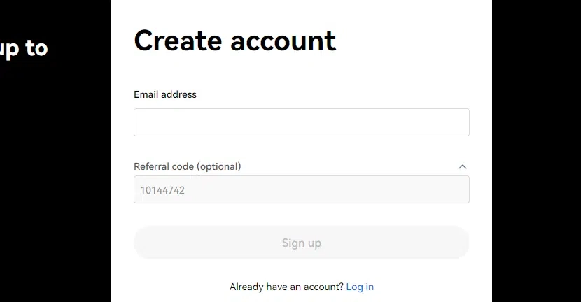
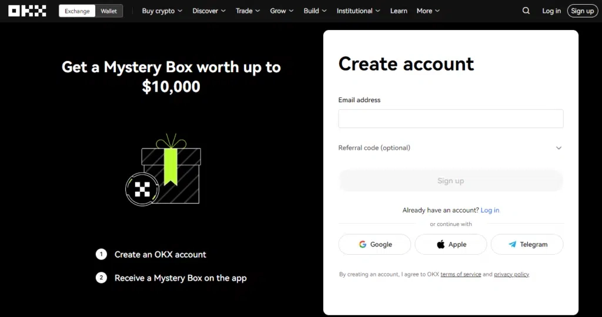

# Get 20% Off Trading Fees with OKX Exchange

Tired of watching trading fees eat into your crypto profits? Looking for a reliable exchange that actually rewards you for bringing friends along? You're in the right spot. OKX Exchange isn't just another trading platform—it's one where you can slash your fees by up to 20% and pocket commissions every time someone you refer makes a trade. Whether you're day-trading Bitcoin or exploring DeFi tokens, keeping more money in your account instead of handing it over in fees makes all the difference.

---

## Getting Your Rebate: The Simple Way

Here's the thing about referral codes—they're only useful if you actually know how to apply them. Let me walk you through this:

First, head over to the OKX Exchange website. You'll see a sign-up form waiting for you. In the referral code field, drop in **47044926**. That's your ticket to the discount.

Hit that "Sign Up" button and fill in your details. Email, password, the usual stuff. Nothing fancy here.

Once you're in, your partner dashboard becomes your new best friend. This is where you'll find your unique referral link—the one you'll share with anyone who asks "which exchange should I use?"

Every time someone clicks your link and actually starts trading, you start earning. Not someday. Not after they hit some massive volume. Daily commissions land in your account based on what your referrals are paying in fees.

The math is straightforward: more active referrals = more money back in your pocket. Some folks see this as a side hustle. Others just appreciate the fees they save on their own trades.

## What's Actually in Your Wallet?

Let's talk numbers. The rebate rate goes up to 20% of the trading fees your referrals generate. That percentage isn't fixed though—it scales with volume.

👉 [Want to see how much you could actually earn? Check the latest commission tiers here](https://www.okx.com/join/47044926)

Think about it this way: if someone you referred trades $10,000 worth of crypto and pays $10 in fees, you're looking at up to $2 back. Now multiply that by multiple active traders over weeks and months. It adds up faster than you'd expect.

## Setting Up Your Account (No Headaches Required)

Ready to actually get started? Here's the play-by-play:

Click through to OKX Exchange. The "Sign Up" button is right there—you can't miss it.

Type in your email and create a password. Pro tip: make it something you'll remember but others won't guess.

Click "Sign Up" again to confirm. Check your inbox for the verification email (might take a minute or two).

Verify that email address. This step is non-negotiable—exchanges take security seriously for good reason.

Once verified, you're in. Log in and you've got full access to spot trading, margin trading, derivatives—the whole lineup.

OKX Exchange has been around long enough to prove it's not going anywhere. The platform handles serious volume daily, offers some of the lowest fees you'll find anywhere, and actually has customer support that responds when things go sideways.

The rebate program is basically free money for something you'd probably do anyway—recommend a solid exchange to friends who ask.

---

## People Also Ask

**Q: How do I qualify for the OKX Exchange rebate program?**

Sign up using referral code **47044926** and you're automatically in. There's no minimum trading requirement for people you refer. They trade, you earn. Simple as that.

**Q: How do I get my OKX Exchange rebate?**

Your rebate hits your OKX Exchange trading account every day. No waiting until the end of the month or jumping through hoops. Once it's there, withdraw it or use it to trade—your call.

**Q: How can I use your referral code to get the OKX Exchange rebate?**

When you're signing up, there's a field for the referral code. Type in **47044926** and you're set. Don't skip this step or you'll miss out on the discount.

**Q: What are the benefits of using OKX Exchange?**

OKX Exchange covers pretty much everything: spot trading, margin trading, derivatives. The fee structure is competitive (sometimes the lowest around), and the platform actually works when the market gets volatile—which is when you need it most.

---

So there you have it. Lower fees, commission potential, and a platform that doesn't make you want to throw your laptop out the window. Whether you're in it for the trading or the rebates (or both), 👉 [OKX Exchange with code 47044926 gets you started on the right foot](https://www.okx.com/join/47044926). The market's not waiting around, and neither should your savings.
